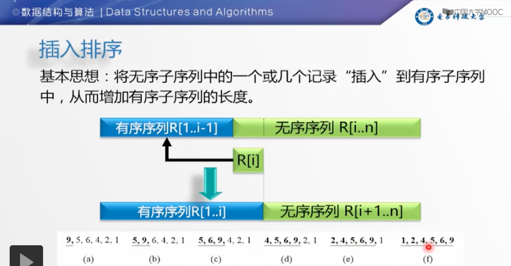
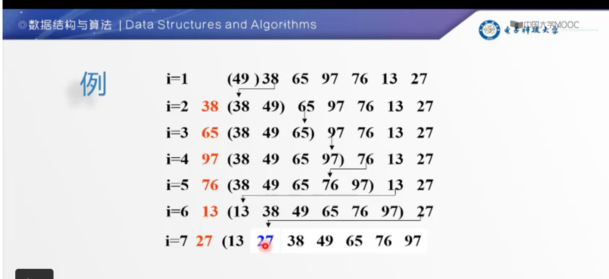

# 插入排序

- 原理

| 原理图 | 排序过程 |
| ----- | ------- |
|  |  |

- 步骤

    - 将第一待排序序列第一个元素看做一个有序序列，把第二个元素到最后一个元素当成是未排序序列。

    - 从头到尾依次扫描未排序序列，将扫描到的每个元素插入有序序列的适当位置。（如果待插入的元素与有序序列中的某个元素相等，则将待插入元素插入到相等元素的后面。）

- [动画演示](../images/sort/InsertSort.gif)

- [实现](../../java/cool/zzy/algorithm/sort/InsertSort.java)