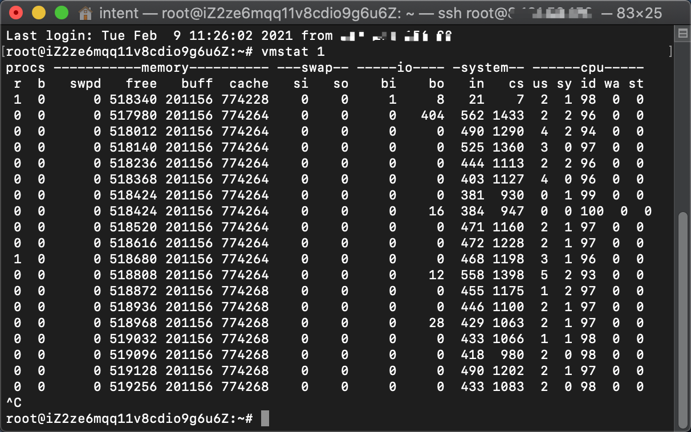
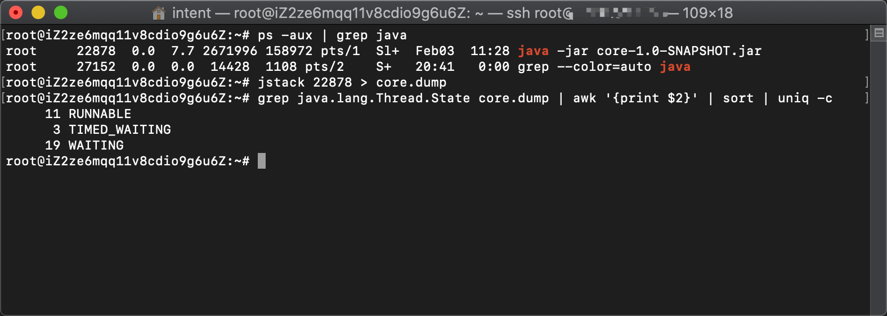

## 1.1 上下文切换

### [1.1.1 并发和串行比较](../../java/cool/zzy/java/concurrent/art/chapter1/Code111ConcurrentTest.java)

### 1.1.2 查看上下文切换次数

```bash
# 查看一秒内上下文切换次数/性能
vmstat 1
# cs就是上下文切换次数
```



可以看到1秒内上下文切换的速度是1000多次。

### 1.1.4 减少上下文切换实战

```bash
# 先用grep命令查看java的pid
ps -aux | grep java
# 用jstack dump线程状态
jstack 22878 > core.dump
# 统计线程状态
grep java.lang.Thread.State core.dump | awk '{print $2}' | sort | uniq -c
# 查看处于WAITING状态的线程都是些啥线程，好针对优化
vim core.dump
```



## [1.2 死锁](../../java/cool/zzy/java/concurrent/art/chapter1/Code12DeadLockDemo.java)

当程序遇到了死锁的问题，我们只能通过`jstack`的dump查看是哪个线程引起了死锁，`jstack`比较智能，如果线程中有死锁，它会直接提示

```text
Found one Java-level deadlock:
=============================
"Thread-0":
  waiting to lock monitor 0x00007f8abe582000 (object 0x000000070fe1b898, a java.lang.String),
  which is held by "Thread-1"
"Thread-1":
  waiting to lock monitor 0x00007f8abab13f00 (object 0x000000070fe1b868, a java.lang.String),
  which is held by "Thread-0"
```

最后通过线程名就可以定位到死锁的代码行了！
