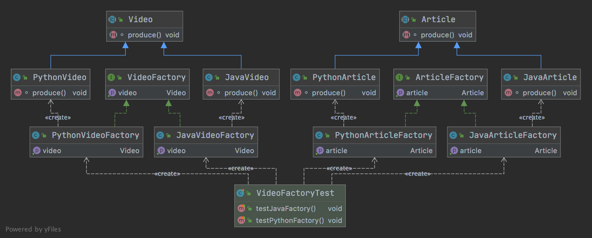

# 工厂方法

- 定义：

      定义一个创建对象的接口
      但让实现这个接口的类来决定实例化哪个类
      工厂方法让类的实例化推迟到子类中进行

- 类型：
      
      创建型

- 适合场景：

      创建对象需要大量重复的代码
      
      客户端（应用层）不依赖于产品类的实例如何被创建、实现等细节
      
      一个类通过其子类来指定创建哪对象
    

## 优缺点

- 优点

      用户只需要关心产品对应的工厂，无需关心创建细节
    
      加入新产品符合开闭原则，提高可扩展性

- 缺点

      类的个数容易过多，增加复杂度
      
      增加了系统的抽象性和理解难度

## 代码

- [代码](../../java/cool/zzy/designpattern/creational/factorymethod)
- [测试](../../../test/java/cool/zzy/designpattern/creational/factorymethod/VideoFactoryTest.java)

## 结构类图


## JDK使用到的工厂方法

```java
/**
* 这就是一个抽象方法的设计模式
* 抽象类 {@link java.util.Collection}}
* 抽象工厂方法 {@link java.util.Collection#iterator()}}
* 抽象产品 {@link java.util.Iterator}
* 实现类 {@link java.util.ArrayList}}
* 实现工厂方法 {@link java.util.ArrayList#iterator()}}
* 实现产品 {@link java.util.ArrayList.Itr}
*/
public class Test{
}
```