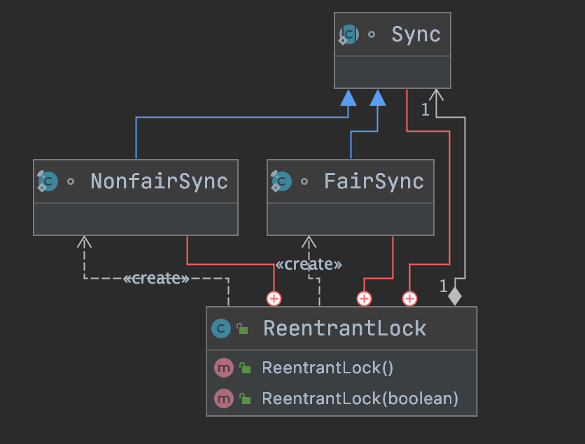

# ReentrantLock

- [对象布局](./ObjectLayout.md)
- [轻量级锁CAS](./CompareAndSwap.md)
- [volatile关键字](./Volatile.md)
- [synchronized关键字](./Synchronized.md)
- [锁升级](./LockUpgrade.md)
- [locks](../../src/main/java/cool/zzy/source/java/util/concurrent/locks)
  - [AQS](./AQS.md)
  - [ReentrantLock](./ReentrantLock.md)

# 资料

- [ReentrantLock源码](https://github.com/zzyandzzy/jdk11/blob/main/src/java.base/share/classes/java/util/concurrent/locks/ReentrantLock.java)
- [仿写源码ZReentrantLock](../../java/cool/zzy/java/util/concurrent/ZReentrantLock.java)
- [测试用例](../../../test/java/cool/zzy/java/util/concurrent/ZReentrantLockTest.java)

可重入锁

## 类图

## 公平锁

ReentrantLock很简单，就是利用AQS的特性实现了同一个线程锁的可重入。 对于公平锁，ReentrantLock在获取不到锁的时候会把当前线程加入等待队列，在队列里面等待前面的线程释放锁才能拿到锁

如果拿到了锁，又要加锁，则在AQS的state标志+1，注意加了几次锁就要释放几次锁

## 非公平锁

对于非公平锁，ReentrantLock来一个线程获取锁直接用CAS自旋，不用管线程等待队列 如果获取不到锁再走公平锁的策略