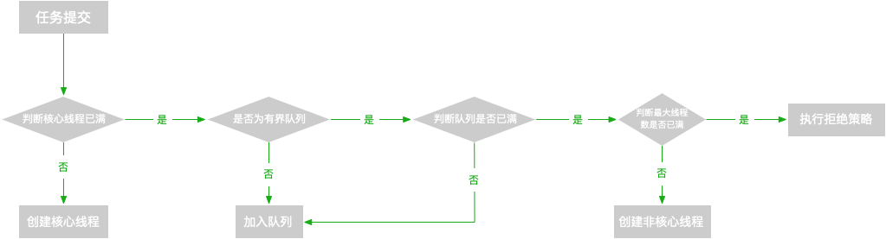

# 线程池

- [对象布局](./ObjectLayout.md)
- [轻量级锁CAS](./CompareAndSwap.md)
- [volatile关键字](./Volatile.md)
- [synchronized关键字](./Synchronized.md)
- [锁升级](./LockUpgrade.md)
- [locks](../../src/main/java/cool/zzy/source/java/util/concurrent/locks)
    - [AQS](./AQS.md)
    - [ReentrantLock](./ReentrantLock.md)
- [ThreadPoolExecutor](./ThreadPoolExecutor.md)

## 资料

- [测试用例](../../../test/java/cool/zzy/java/util/concurrent/ThreadPoolExecutorTest.java)

## 翻译

线程池用来解决两个不同的问题

- 当执行大量异步任务时，它们通常提供更好的性能，因为它们减少了每个任务的调用开销，并且它们提供了一种绑定和管理在执行任务集合时消耗的资源(包括线程)的方法。
- 每个ThreadPoolExecutor还维护一些基本统计信息，比如已完成任务的数量。

这个类运用的很广泛，建议程序员使用`Executor`工厂方法来创建线程池，如：

```java
import java.util.concurrent.Executors;

/**
 * {@link Executors#newCachedThreadPool} 这个线程池的核心线程为0，最大线程为{@link Integer#MAX_VALUE}，线程存活时间为60秒，适合短小的业务
 * 如：WebMVC、Netty的Handler等
 * {@link Executors#newFixedThreadPool} 这个线程池核心线程和最大线程一样，线程生存时间为0（默认值），线程池中的线程会一直存在！
 * {@link Executors#newSingleThreadExecutor()} 这个线程池核心线程和最大线程都是一，单例的线程池，保证提交线程执行任务的FIFO
 */
class Test {
}
```

如果我们要自定义线程池，那么我们必须知晓下面这些参数：

corePoolSize（核心线程数）和maximumPoolSize（最大线程数）： 这两个值控制了线程池的大小。

- 当一个任务提交时，如果运行的线程小于corePoolSize（核心线程数），那将创建一个新的线程处理请求，即使其他的线程可能此时是空闲的。
- 如果运行的线程小于maximumPoolSize（最大线程数）大于corePoolSize（核心线程数），那么只有当队列满时，才会创建一个新线程来处理请求。
- 当corePoolSize（核心线程数）和maximumPoolSize（最大线程数）一样时，你将会得到一个固定大小的线程池。
- 当maximumPoolSize（最大线程数）设置为一个很大的值，如`Integer#MAX_VALUE`时，这个线程池将会容纳无限的线程。

其他：
默认情况下，所只有当任务提交时，才会创建线程去执行任务，但是可以使用`prestartCoreThread`(启动一个核心线程)和`prestartAllCoreThreads`（启动所有核心线程）来提前创建好线程。

创建新的线程：
使用`ThreadFactory`创建一个新的线程，如果没有设置，将会用`Executors.defaultThreadFactory`来创建线程，创建的线程拥有同样的线程组，
一样的优先级`Thread.NORM_PRIORITY`（默认为5，最小为1，最大为10），和非守护线程状态。当然我们可以提供一个`ThreadFactory`来自己创建线程，
自定义线程的名字等等，对于后续出现bug排除有很大的方便。

keepAliveTime（线程存活时间）
如果当前运行的线程超过corePoolSize（核心线程数），并且有线程空闲的时间大于keepAliveTime（线程存活时间），那么这个线程将会被终结。
默认情况下只有当前运行的线程超过corePoolSize并且有线程控件时间大于keepAliveTime才会结束线程，
但是可以通过`allowCoreThreadTimeOut(boolean)`方法设置核心线程也受到keepAliveTime（线程存活时间）的影响，只要keepAliveTime不为零。

Queuing（等待队列）： 任何BlockingQueue都可以用来传输和保存提交的任务。这个队列的使用与池大小相互作用。
- 如果运行的线程小于corePoolSize（核心线程数），那么`Executor`总是创建一个新线程，而不是排队。
- 如果运行的线程大于corePoolSize（核心线程数）并且有足够的队列空间，那么`Executor`总是排队，而不是创建一个线程。
- 如果一个请求不能被排队，那么一个新的线程就会被创建，除非它超过了maximumPoolSize（最大线程数），在这种情况下，任务将会被拒绝。

因此，现在的线程池执行顺序如下：



排队的策略有三种：

1. Direct handoffs

直接切换通常需要无限制的最大池大小，以避免拒绝新提交的任务。这反过来承认，当命令以高于处理速度的平均速度继续到达时，线程可能会无限增长。

2. Unbounded queues（无界队列）

3. Bounded queues（有界队列）

