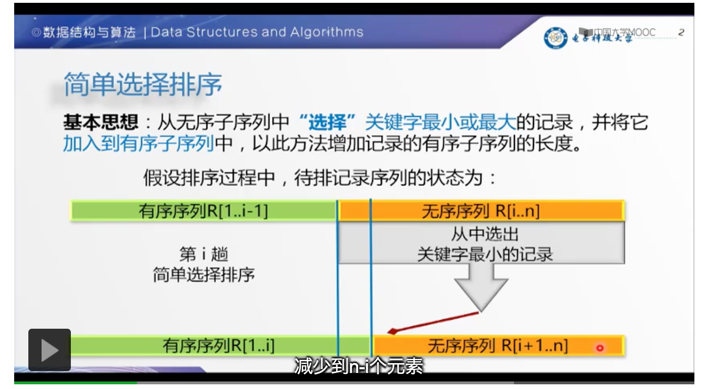
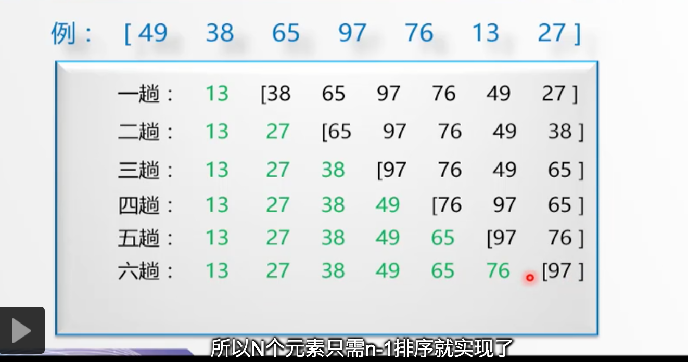

# 选择排序

- 原理

| 原理图 | 排序过程 |
| :---: | :-----: |
|  |  |

- 步骤

    - 首先在未排序序列中找到最小（大）元素，存放到排序序列的起始位置
    
    - 再从剩余未排序元素中继续寻找最小（大）元素，然后放到已排序序列的末尾。
    
    - 重复第二步，直到所有元素均排序完毕。

- [动画演示](../../../其他/algorithm/sort/SelectionSort.gif)

- [实现](../../../src/main/java/cool/zzy/demo/algorithm/sort/SelectSort.java)