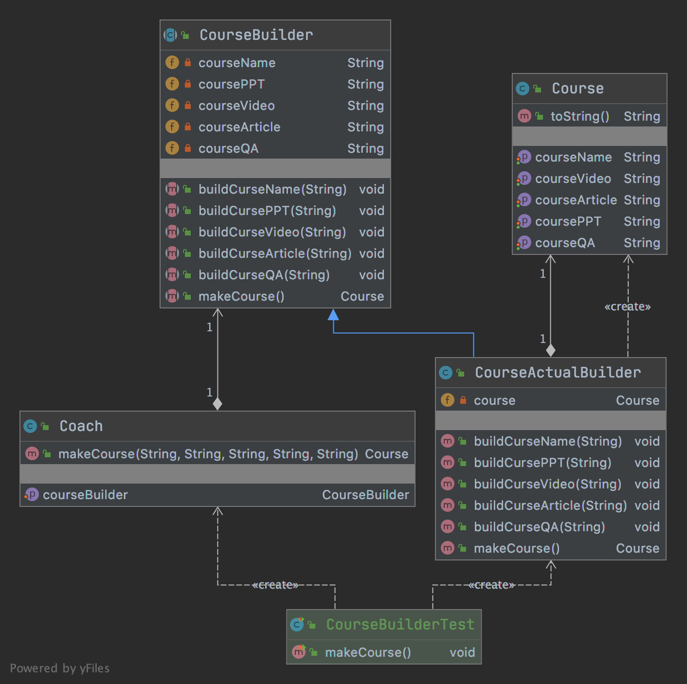
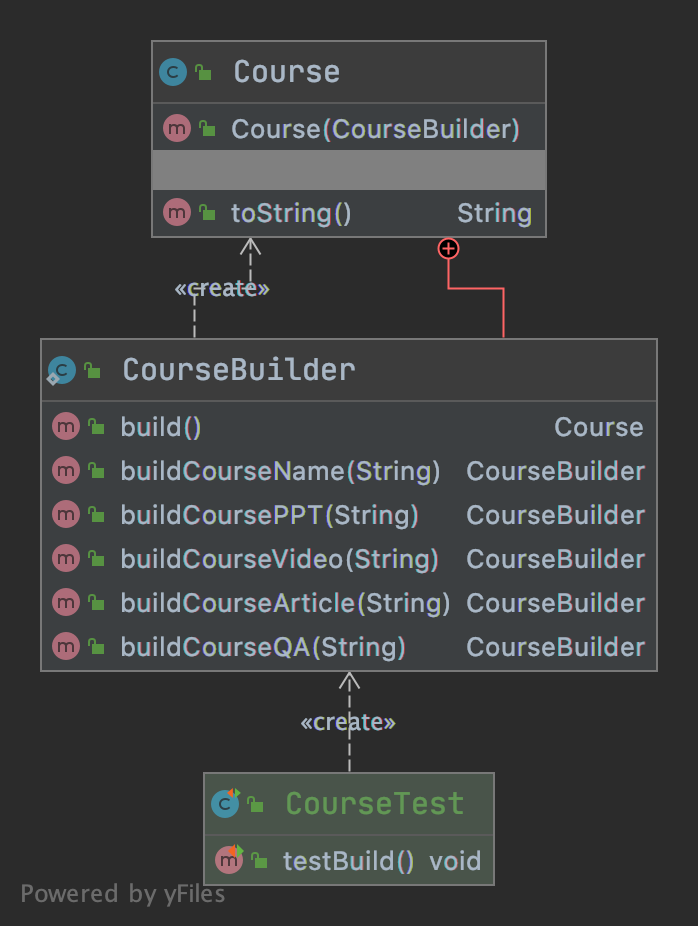

# 建造者

- 定义

      将一个复杂对象的构建与它的表示分离，使得同样的构建过程可以创建不同的表示

- 类型

        创建型

- 适用场景

      流程固定单顺序不一定固定的
      用户只需指定需要建造的类型就可以得到它们，建造过程及细节不需要知道
      
         
## 优缺点

- 优点

      封装性好，创建和使用分离
      
      扩展性好、建造类之间独立，一定程度上解耦

- 缺点

      产生多余的Builder对象
      
      产品内部发生变化，建造者都需要修改，成本较大

## 代码

- v1
  - [代码](../../../src/main/java/cool/zzy/demo/designpattern/creational/builder)
  - [测试](../../../src/test/java/cool/zzy/demo/designpattern/creational/builder/CourseBuilderTest.java)

- v2
  - [代码](../../../src/main/java/cool/zzy/demo/designpattern/creational/builder/v2)
  - [测试](../../../src/test/java/cool/zzy/demo/designpattern/creational/builder/v2/CourseTest.java)

## 结构类图

| V1版本 | V2版本 |
| :--------: | :--------: |
|  |  |

## JDK使用到的Builder设计模式

```java
import cool.zzy.demo.designpattern.creational.builder.CourseActualBuilder;
import cool.zzy.demo.designpattern.creational.builder.CourseBuilder;

/**
 * {@link AbstractStringBuilder} 就相当于
 * {@link CourseActualBuilder}
 * {@link StringBuilder} 和{@link StringBuffer} 就相当于
 * {@link CourseBuilder}
 */
public class Test {
}
```
