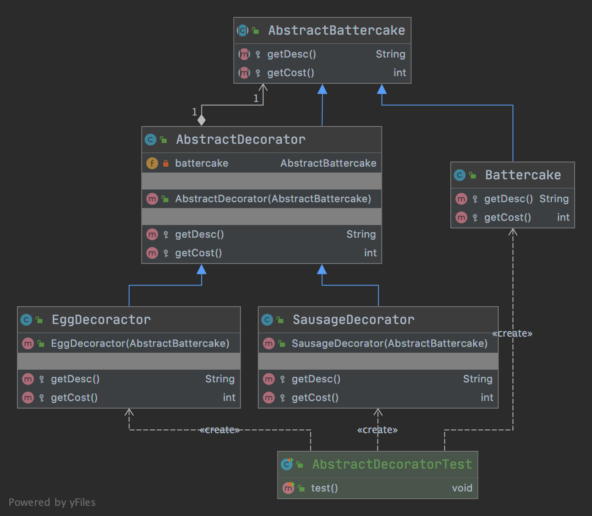
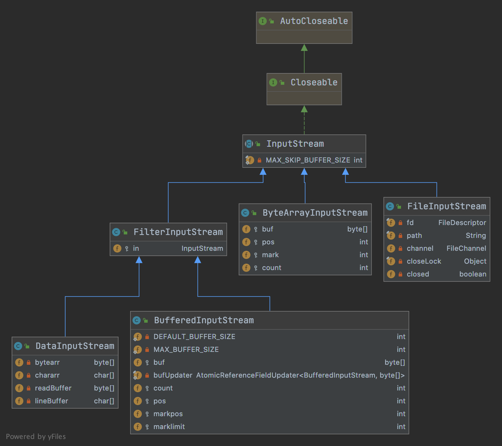

# 装饰者

- 定义

      在不改变原有对象的基础上，将功能附加到对象上
      
      提供了比继承更有弹性的替代方案（扩展原有对象功能）
      
- 类型

        结构性

- 适用场景

      扩展一个类的功能或给一个类添加附加职责
      
      动态的给一个对象添加功能，这些功能可以再动态的撤销
         
## 优缺点

- 优点

      继承的有力补充，比继承灵活，不改变原有对象的情况下给一个对象扩展功能。
      
      通过使用不同的装饰类以及这些装饰类的排列组合，可以实现不同的效果
      
      符合开闭原则

- 缺点

      会出现更多的代码，更多的类，增加代码复杂性
      
      动态装饰时，多层装饰时会更加复杂

## 代码

- [代码](../../../src/main/java/cool/zzy/demo/designpattern/structural/decorator)
- [测试](../../../src/test/java/cool/zzy/demo/designpattern/structural/decorator/AbstractDecoratorTest.java)

## 结构类图

## JDK使用到的装饰器模式

