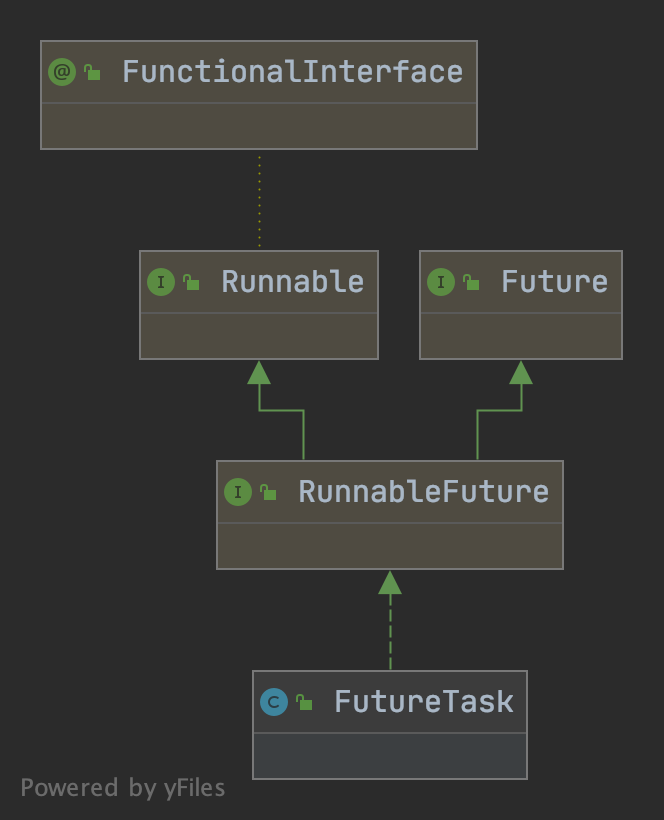

# FutureTask

- [Callable源码](https://github.com/zzyandzzy/jdk11/blob/main/src/java.base/share/classes/java/util/concurrent/Callable.java)
- [Future源码](https://github.com/zzyandzzy/jdk11/blob/main/src/java.base/share/classes/java/util/concurrent/Future.java)
- [FutureTask源码](https://github.com/zzyandzzy/jdk11/blob/main/src/java.base/share/classes/java/util/concurrent/FutureTask.java)
- [测试用例](../../../src/test/java/cool/zzy/java/util/concurrent/FutureTaskTest.java)

